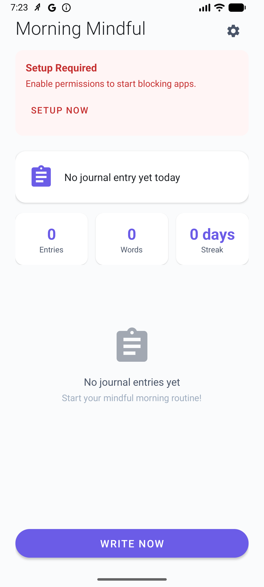

# Morning Mindful

[](https://developer.android.com)
[](https://android-arsenal.com/api?level=26)
[](https://kotlinlang.org)
[](LICENSE)

A digital wellbeing Android app that helps you build a mindful morning routine by blocking social media apps until you complete a journal entry.

## Features

- **Smart App Blocking** - Blocks social media and messaging apps during your morning hours
- **Journal to Unlock** - Write a configurable number of words to unlock blocked apps
- **Morning Window** - Blocking only activates during your configured morning hours
- **Dark Mode** - Full dark theme support with system, light, and dark options
- **Streak Tracking** - Track your journaling streak and total word count
- **Encrypted Storage** - Journal entries are encrypted with SQLCipher
- **Auto-Backup** - Automatic encrypted backups to a local folder of your choice
- **Export/Import** - Password-protected backup files with AES-256 encryption
- **Offline First** - All data stored locally, no account required
- **Customizable** - Configure blocked apps, word count, duration, and morning window

## How It Works

1. **Morning Detection** - When you unlock your phone during morning hours, the blocking period begins
2. **App Blocking** - Opening blocked apps (Instagram, TikTok, WhatsApp, etc.) shows the journal screen
3. **Write to Unlock** - Complete your journal entry with the required word count
4. **Freedom** - All apps are unlocked for the rest of the day

**Always in Control:** You can disable blocking anytime via Settings, or wait for the timer to expire.

## Screenshots

<!-- Add screenshots here -->
| Home | Journal | Settings |
|:----:|:-------:|:--------:|
|  |  |  |

## Tech Stack

| Technology | Purpose |
|------------|---------|
| **Kotlin** | Primary language with Coroutines & Flow |
| **Hilt** | Dependency injection |
| **Room + SQLCipher** | Encrypted local database |
| **EncryptedSharedPreferences** | Secure settings storage |
| **MVVM** | Architecture pattern |
| **Material Design 3** | Modern UI components |
| **Firebase Crashlytics** | Crash reporting |
| **AdMob** | Monetization |

## Project Structure

```
app/src/main/java/com/morningmindful/
├── MorningMindfulApp.kt              # Application class
├── data/
│   ├── AppDatabase.kt                # Room database with encryption
│   ├── DatabaseKeyManager.kt         # Encryption key management
│   ├── dao/                          # Data access objects
│   ├── entity/                       # Database entities
│   └── repository/                   # Repository pattern
├── di/                               # Hilt modules
├── service/
│   ├── AppBlockerAccessibilityService.kt  # Core blocking logic
│   ├── MorningBlockerService.kt      # Foreground service
│   ├── ScreenUnlockReceiver.kt       # Screen unlock detection
│   └── BootReceiver.kt               # Boot completion handler
├── ui/
│   ├── main/                         # Home screen
│   ├── journal/                      # Journal entry screen
│   └── settings/                     # Settings screen
└── util/
    ├── BlockingState.kt              # Shared blocking state
    ├── BlockedApps.kt                # Default blocked apps list
    └── PermissionUtils.kt            # Permission helpers
```

## Building

### Prerequisites

- Android Studio Hedgehog (2023.1.1) or newer
- JDK 17
- Android SDK 35

### Setup

1. Clone the repository
   ```bash
   git clone https://github.com/alanmurfi/MorningMindful.git
   cd MorningMindful
   ```

2. Create `secrets.properties` in the root directory (not tracked in git):
   ```properties
   ADMOB_APP_ID=ca-app-pub-xxxxx~xxxxx
   ADMOB_BANNER_ID=ca-app-pub-xxxxx/xxxxx
   ```

3. Create `keystore.properties` for release builds (not tracked in git):
   ```properties
   storeFile=/path/to/keystore.jks
   storePassword=your_password
   keyAlias=your_alias
   keyPassword=your_key_password
   ```

4. Build and run
   ```bash
   ./gradlew assembleDebug
   ./gradlew installDebug
   ```

## Required Permissions

The app requires two special permissions to function:

### 1. Accessibility Service
- **Purpose:** Detect when blocked apps are launched
- **Setup:** Settings → Accessibility → Morning Mindful → Enable

### 2. Display Over Other Apps
- **Purpose:** Show journal screen over blocked apps
- **Setup:** Settings → Apps → Morning Mindful → Display over other apps → Enable

## Configuration

| Setting | Default | Range | Description |
|---------|---------|-------|-------------|
| Enable Blocking | On | On/Off | Master toggle for app blocking |
| Blocking Duration | 15 min | 5-60 min | Time before auto-unlock |
| Required Words | 200 | 50-500 | Words needed to unlock |
| Morning Start | 5:00 AM | 0-23 | When blocking can activate |
| Morning End | 10:00 AM | 1-24 | When blocking stops |
| Theme | System | System/Light/Dark | App appearance |

## Default Blocked Apps

- **Social Media:** Instagram, Facebook, Twitter/X, TikTok, Snapchat, LinkedIn, Pinterest, Reddit, Threads
- **Messaging:** WhatsApp, Telegram, Discord, Slack, Messenger
- **Entertainment:** YouTube, Netflix
- **Browsers:** Chrome (optional)

Customize the blocked apps list in Settings.

## Privacy & Security

- **Local Storage Only** - All data stays on your device
- **Encrypted Database** - Journal entries encrypted with SQLCipher (AES-256)
- **Encrypted Preferences** - Settings stored in EncryptedSharedPreferences
- **Encrypted Backups** - Export/import with AES-256-GCM encryption
- **Auto-Backup Protection** - Automatic backups use your password for encryption
- **No Analytics** - No tracking or data collection (except crash reports)
- **Minimal Permissions** - Only requests what's necessary

## Testing

```bash
# Run unit tests
./gradlew test

# Run instrumented tests (requires device/emulator)
./gradlew connectedAndroidTest
```

## Contributing

Contributions are welcome! Please feel free to submit a Pull Request.

1. Fork the repository
2. Create your feature branch (`git checkout -b feature/amazing-feature`)
3. Commit your changes (`git commit -m 'Add amazing feature'`)
4. Push to the branch (`git push origin feature/amazing-feature`)
5. Open a Pull Request

## License

This project is licensed under the MIT License - see the [LICENSE](LICENSE) file for details.

## Acknowledgments

- Built with [Claude Code](https://claude.ai/claude-code)
- Icons from [Material Design Icons](https://materialdesignicons.com)

---

**Download on Google Play:** [Coming Soon]
